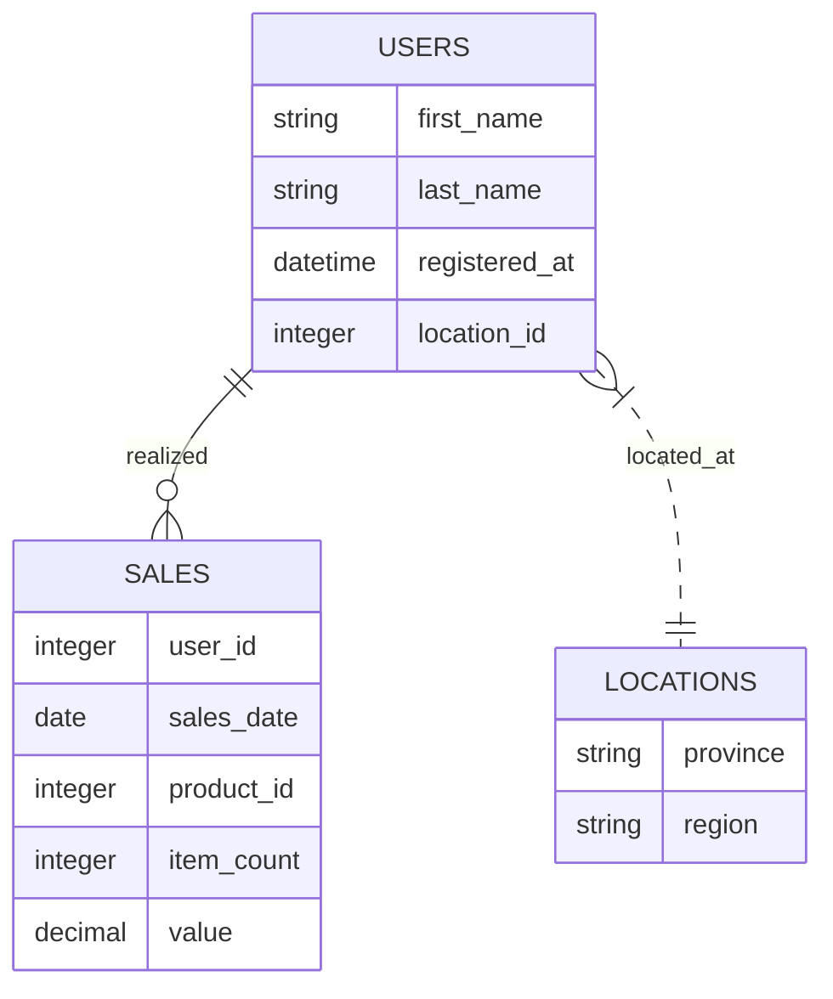

# Okxe Data Analyst 2022-09-01

Đề bài vòng 1 cho vị trí data analyst ở okxe. [JD](https://vn.linkedin.com/jobs/view/data-analyst-at-okxe-inc-3260815775).

## Tóm tắt yêu cầu

{max-width: 300px, display: block, margin: 0 auto}

## Hướng giải

Based on the sample data, I made these assumptions with the ER diagram as follows.
- "users" table is connected to "sales" table by matching "id" column and "user_id" column from both table, respectively
- a user can have 0 or many orders
- "users" table is connected to "locations" table by matching "location_id" column and "id" column from both table, respectively
- a user must be located at one location. A location can be registered by one or many users.

Copy this [gist](https://gist.github.com/h7b/c60cab8f393a6cf55517df61ac409881#file-20220916-okxe_schema-sql) into [db-fiddle](https://www.db-fiddle.com/) "Schema SQL" pane to create the sample data tables. Then choose "Database" as "MySQL v8.0". Start to fiddle the SQL.

### Q1 (Basic)

![[notes.daily.2022-09-05.okxe-data-analyst.q1#question]]

![[notes.daily.2022-09-05.okxe-data-analyst.q1#answer]]

### Q2 (Intermediate)

![[notes.daily.2022-09-05.okxe-data-analyst.q2#question]]

![[notes.daily.2022-09-05.okxe-data-analyst.q2#answer]]

### Q3 (Intermediate)

![[notes.daily.2022-09-05.okxe-data-analyst.q3#question]]

![[notes.daily.2022-09-05.okxe-data-analyst.q3#answer]]

### Q4 (Advanced)

![[notes.daily.2022-09-05.okxe-data-analyst.q4#question]]

![[notes.daily.2022-09-05.okxe-data-analyst.q4#answer]]

### Q5 (Advanced)

![[notes.daily.2022-09-05.okxe-data-analyst.q5#question]]

### Q6 Business Question

![[notes.daily.2022-09-05.okxe-data-analyst.q6#question]]

![[notes.daily.2022-09-05.okxe-data-analyst.q6#answer]]