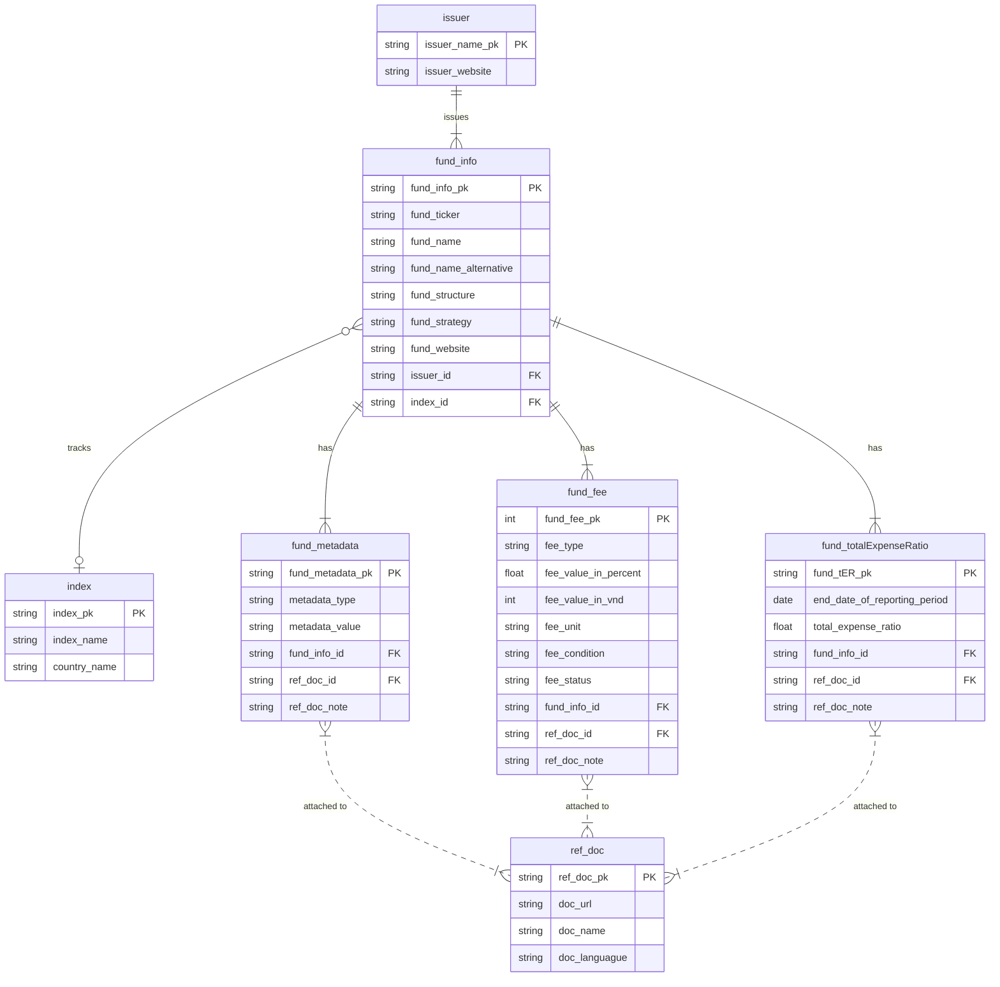

# Investment fund for individual in Vietnam

## Methodology

- compare the performance of each financial instrument with respect to their fee
    - the performance is defined by the return ratio of NAV/fund certificate
- compare the basis stats like P/E, P/B, ROE
- establish the correlation between these financial instrument based on the holdings in their portfolio. This correlation matrix is expected to match the benchmark index of each investment fund

## Data model

I collected the information and the historical price data manually then put into [this spreadsheet](https://docs.google.com/spreadsheets/d/1qsWWEUE87dsR_4MmEfBID_6d20Oz1e5JYLP8NiEPngo/edit?usp=sharing), which has an ER diagram as follows.

## ETF

## [VFMVN DIAMOND ETF (FUEVFVND)](https://dragoncapital.com.vn/en/vfmvn-diamond-etf-fund-fuevfdmd/overview/)

![[notes.daily.2022-05-30.fuevfvnd#overview,1:#*]]

## [VFMVN30 ETF (E1VFVN30)](https://dragoncapital.com.vn/en/etf-vfmvn30-fund-e1vfvn30/etf-overview/)

![[notes.daily.2022-05-30.e1vfvn30#overview,1:#*]]

## [SSIAM VN30 ETF (FUESSV30)](https://www.ssi.com.vn/en/ssiam/fund-information-ssiam-vn30)

![[notes.daily.2022-05-30.fuessv30#overview,1:#*]]

## [MAFM VN30 ETF (FUEMAV30)](https://www.masvn.com/en/cate/general-information-1561)

![[notes.daily.2022-05-30.fuemav30#overview,1:#*]]

## Open-end fund