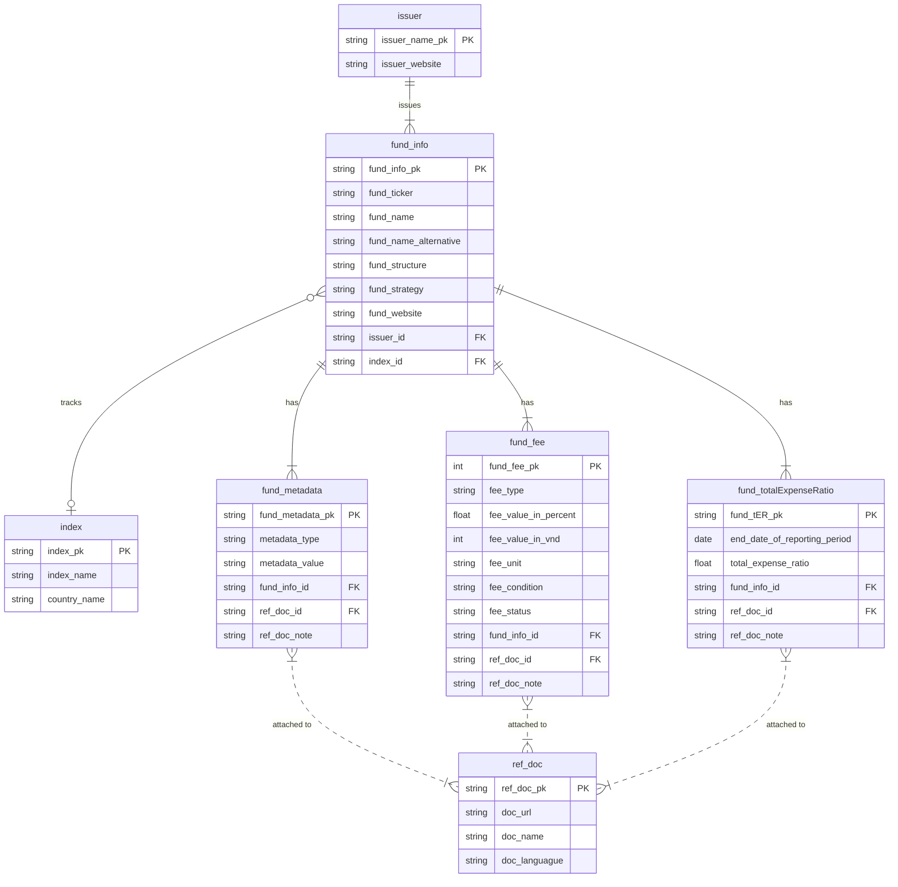

# Data model

## Overview

I collected the information and the historical price data manually then put into [this spreadsheet](https://docs.google.com/spreadsheets/d/1qsWWEUE87dsR_4MmEfBID_6d20Oz1e5JYLP8NiEPngo/edit?usp=sharing), which has an ER diagram as follows.

