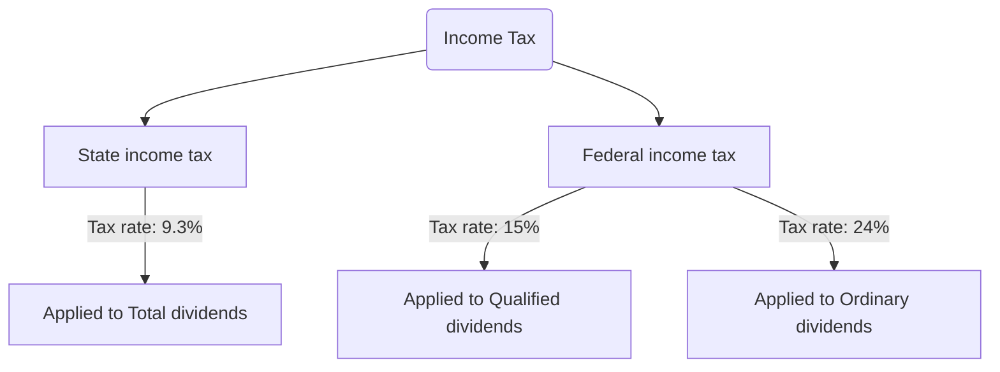

# Reading 2022-03-31

## Metadata

- Ref:: [Investopedia](https://www.investopedia.com/articles/investing/072313/investment-tax-basics-all-investors.asp)
- Title:: Tax Basics for Investors
- Author:: Neil O’Hara
- Year of publication:: 2021
- Category:: Blog
- Topic:: #topic.investment
- Related::
    - [Capital Gains Tax 101](https://www.investopedia.com/taxes/capital-gains-tax-101/)
    - [[ETF Tax in US|notes.reading.etf-tax-us]]
    - [[Income Tax in US|notes.reading.tax-investors-us.income-tax-us]]
    - [How Capital Gains and Dividends Are Taxed Differently](https://www.investopedia.com/ask/answers/12/how-are-capital-gains-dividends-taxed-differently.asp)
    - [Long-Term Capital Gain or Loss](https://www.investopedia.com/terms/l/long-term_capital_gain_loss.asp)
    - [Ordinary Income](https://www.investopedia.com/terms/o/ordinaryincome.asp)
    - [How Capital Gains and Dividends Are Taxed Differently](https://www.investopedia.com/ask/answers/12/how-are-capital-gains-dividends-taxed-differently.asp)
    - [Income Tax vs. Capital Gains Tax: What’s the Difference?](https://www.investopedia.com/ask/answers/052015/what-difference-between-income-tax-and-capital-gains-tax.asp)

## Notes from reading

The federal government taxes 
- not only investment income: dividends, interest, and rent on real estate
- but also realized capital gains [^1]

Investors that earn dividends or capital gains, by selling assets from their portfolios resulting in either a [realized gain](https://www.investopedia.com/terms/r/realizedprofit.asp) or loss, are subject to pay taxes on those gains
- [[Federal Income Tax|notes.reading.tax-investors-us.income-tax-us#federal-income-tax]] on
    - `Short-term capital gains` and `ordinary dividends` are treated the same as income and taxed at the current income tax bracket level
    - `Long-term capital gains` and `qualified dividends` have favorable tax treatment that is lower than ordinary income tax rates
- [[State Income Tax|notes.reading.tax-investors-us.income-tax-us#state-income-tax]] on
    - `Short-term capital gains` and `ordinary dividends`
    - `Long-term capital gains` and `qualified dividends`

### Tax on Dividends

- [[qualified dividends|notes.reading.tax-investors-us.qualified-dividend]]
    - A qualified dividend is taxed at the capital gains tax rate [^3]
    - The tax rate for qualified dividends ranges from 0% to 20% [^2] [^3]
- [[ordinary dividends|notes.reading.tax-investors-us.ordinary-dividend]]
    - aka non-qualified / unqualified dividends
    - ordinary dividends are taxed at standard [[federal income tax rates|notes.reading.tax-investors-us.income-tax-us#2022-federal-income-tax-brackets-and-rates]] [^3]
    - The maximum tax rate for ordinary dividends for the 2021 and 2022 calendar years, is 37% [^2] [^3]

### Tax on capital gains

For capital gains, there are two rates:
- Long-term (for assets held longer than one year)
    - Long-term capital gains are smaller with a maximum of 20%
- Short-term (less than one year)
    - Short-term gains are taxed as [ordinary income](https://www.investopedia.com/terms/o/ordinaryincome.asp), taxable at [[federal income tax rates|notes.reading.tax-investors-us.income-tax-us#2022-federal-income-tax-brackets-and-rates]]

### Additional rules if applicable

- Individuals with substantial income from investing may also pay an additional 3.8% [Net Investment Income Tax (NIIT)](https://www.investopedia.com/terms/n/netinvestmentincome.asp)
- You are subject to the [wash-sale](https://www.investopedia.com/terms/w/washsale.asp) rules if you sell a stock for a loss and then buy it back within 30 days

### Example

Situation:
- young couple, California residents, married filing jointly, annual wages under USD 170k
- have a USD 20k-investment [[taxable account|notes.reading.investment-accounts-us#taxable-accounts]], with
    - short-term gain/loss: 0
    - long-term gain/loss: 0
    - ordinary dividends: USD 460
    - qualified dividends: USD 312
- how much is the tax bill on investment account on 2021?

Applied into this situation, we will have:
- [[federal income tax rates|notes.reading.tax-investors-us.income-tax-us#2022-federal-income-tax-brackets-and-rates]]: 24%
- [[California state income tax rate|notes.reading.tax-investors-us.income-tax-us#california-state-income-tax]]: 9.3%
    - California taxes all income from all sources inside and outside California
    - It does not have a lower rate for qualified dividends. All dividends are taxed as ordinary income
- [[qualified dividends|notes.reading.tax-investors-us.qualified-dividend]] are taxed at 15%
- [[ordinary dividends|notes.reading.tax-investors-us.ordinary-dividend]] are taxed at 24%

So the tax bill on investment account will be:
- California state income tax:
    - $9.3\%*(460+312)=\$\ 72$
- Federal state income tax:
    - $24\%*460+15\%*312=110.4+46.8=\$\ 157.2$

[^1]: Internal Revenue Service. [Publication 550: Investment Income and Expenses](https://www.irs.gov/pub/irs-pdf/p550.pdf#page=2), Page 2. Accessed Sept. 24, 2020.

[^2]: Internal Revenue Service. [IRS Provides Tax Inflation Adjustments for Tax Year 2022](https://www.irs.gov/newsroom/irs-provides-tax-inflation-adjustments-for-tax-year-2022). Accessed Jan. 22, 2022.

[^3]: Internal Revenue Service. [Publication 550: Investment Income and Expenses (Including Capital Gains and Losses), Page 19](https://www.irs.gov/pub/irs-pdf/p550.pdf#page=19). Accessed Jan. 22, 2022.
